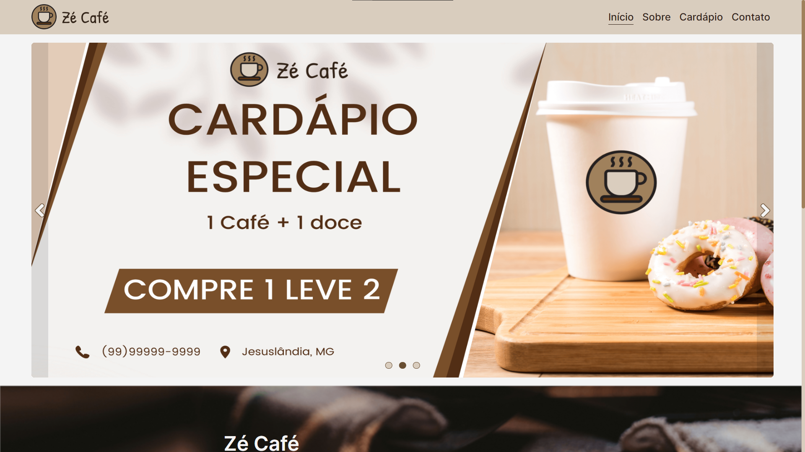
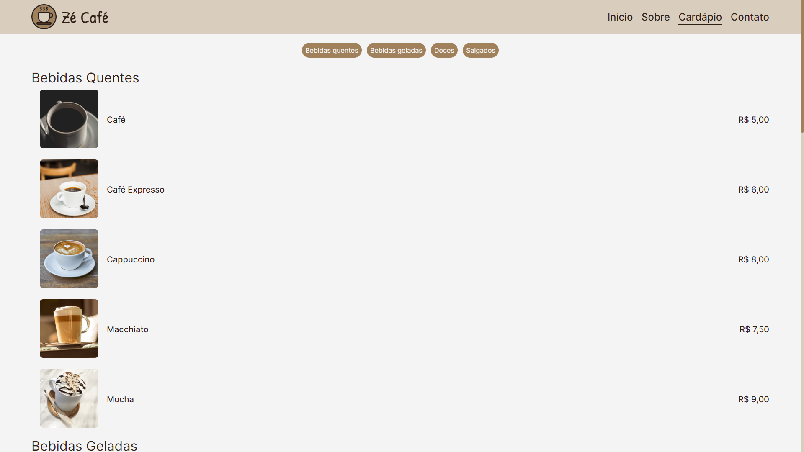

## Atividade 03 - Desenvolvimento de uma Landing Page

## 📌 Sobre

**Zé Café** é um site de cafeteria desenvolvido como parte da atividade 03 - Criação de uma Landing Page.

## ✏ Para iniciar o projeto, siga os passos abaixo

- Abra o arquivo index.html, localizado na pasta "pages", utilizando um navegador.

## 🎨 Colors

| Color             | Hex                                                                |
| ----------------- | ------------------------------------------------------------------ |
| Bone |  #d9cdbe |
| Silver |  #c4bbaf |
| Cinereous |  #a5978b |
| Chamoisee |  #a0815c |
| Coffee |  #684e32 |
| Sepia |  #5d3a00 |
| Bistre |  #312217 |
| White |  #f4f4f4 |
| Toast-success |  #008a2e |
| Toast-success-background |  #ecfdf3 |
| Toast-error |  #e60000 |
| Toast-error-background |  #fff0f0 |

## 👀 O projeto pode ser vizualizado acessando o seguinte link

<https://zecafe.vercel.app/>

## 💻 Exemplo do projeto

## 📋 Notas

>O projeto não possui responsividade. Para um funcionamento adequado, ajuste a tela para as proporções de 1920x1080px
