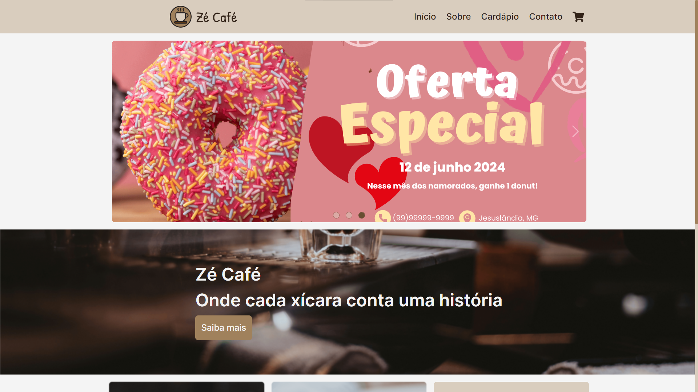

## Atividade 04 - Aprimoramento de projeto

## 🖥 Desktop

## 📱 Mobile

## 📌 Sobre

**Zé Café** é um site de cafeteria desenvolvido como parte da atividade 03 - Criação de uma Landing Page e refatorado na atividade 04 - Aprimoramento de projeto.

## 🚀 Tecnologias utilizadas

O projeto foi desenvolvido utilizando as seguintes tecnologias:

- [Bootstrap](https://getbootstrap.com/)
- [Toastify-js](https://github.com/apvarun/toastify-js)

## ✏ Para iniciar o projeto, siga os passos abaixo

- Abra o arquivo index.html, localizado na pasta "pages", utilizando um navegador. De preferência abra utilizando o Live Server do vscode para evitar problemas com cors.

## 🎨 Cores

| Cor             | Hex                                                                |
| ----------------- | ------------------------------------------------------------------ |
| Bone |  #d9cdbe |
| Silver |  #c4bbaf |
| Cinereous |  #a5978b |
| Chamoisee |  #a0815c |
| Coffee |  #684e32 |
| Sepia |  #5d3a00 |
| Bistre |  #312217 |
| White |  #f4f4f4 |

## 👀 O projeto pode ser vizualizado acessando o seguinte link

<https://zecafe.vercel.app/>

## 💻 Exemplo do projeto

https://github.com/user-attachments/assets/1b30599c-2081-40dc-a328-1cb803f119e5

