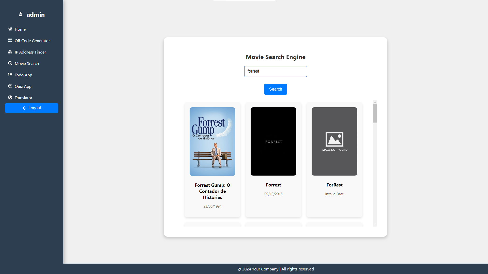
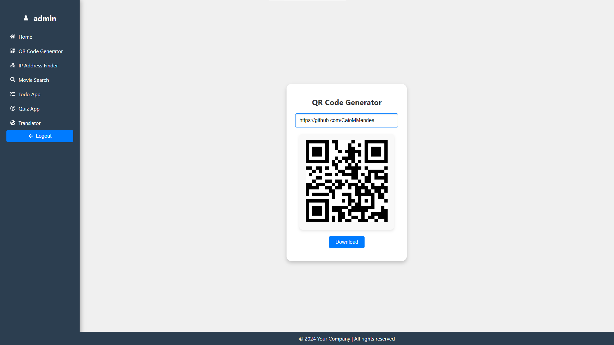
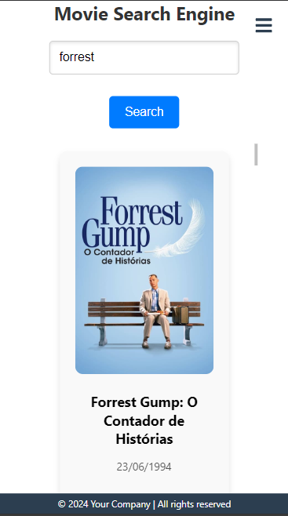
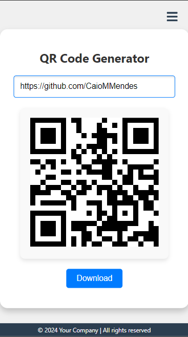

## 🖥 Desktop

## 📱 Mobile

## 📌 Sobre

**Atividade 5 - Melhoria do Código Front-End.**

O projeto já continha os códigos das páginas, mas passou por uma refatoração para melhorar a funcionalidade, legibilidade e manutenção do código.

### Funcionalidades

- **Login**
- **Buscador de IP**
- **Tradutor**
- **Busca de filmes**
- **Gerador de QRCode**
- **Quiz**
- **Todo App**

## 🚀 Tecnologias utilizadas

O projeto foi desenvolvido utilizando as seguintes tecnologias:

- [Vite](https://vitejs.dev/)
- [TMDB](https://www.themoviedb.org/?language=pt-BR)
- [Styled Components](https://styled-components.com/)
- [React-router](https://reactrouter.com/en/main)
- [React-icons](https://react-icons.github.io/react-icons/)
- [Zustand](https://zustand-demo.pmnd.rs/)
- [React-responsive-carousel](https://react-responsive-carousel.js.org/)
- [Axios](https://axios-http.com/)
- [Qrcode.react](https://github.com/zpao/qrcode.react)
- [Sonner](https://sonner.emilkowal.ski/)
- [Jose](https://github.com/panva/jose)

## ✏ Como rodar localmente

- Clonar o repositório
    <pre><code>git clone https://github.com/CaioMMendes/MaisPraTi</code></pre>

- Acessar a pasta da atividade desejada pelo terminal (caso não esteja na pasta da atividade)
    <pre><code>cd modulo04/atividade05</code></pre>

- Instalar as dependências (precisa ter o node instalado no computador)
    <pre><code>npm i</code></pre>

- Executar o projeto
    <pre><code>npm run dev</code></pre>

- Abrir o navegador na porta informada no terminal

## 💻 O projeto pode ser vizualizado acessando o seguinte link

<https://atividade05-caio.vercel.app/>

## 👀 Exemplo

https://github.com/user-attachments/assets/282d214d-75c5-4022-b623-6c1217e87461

