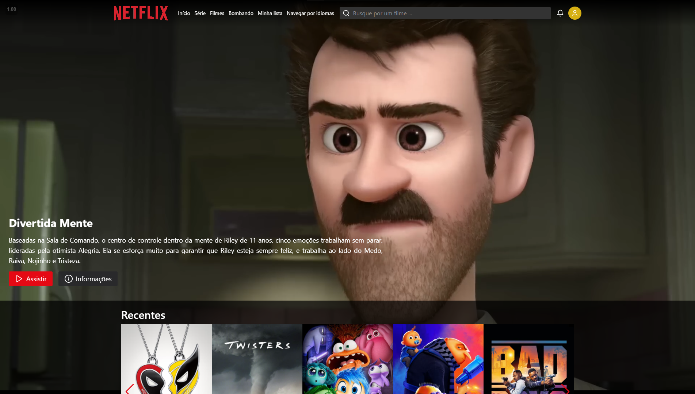
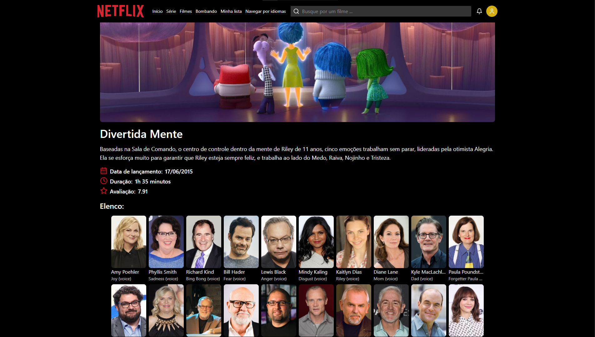
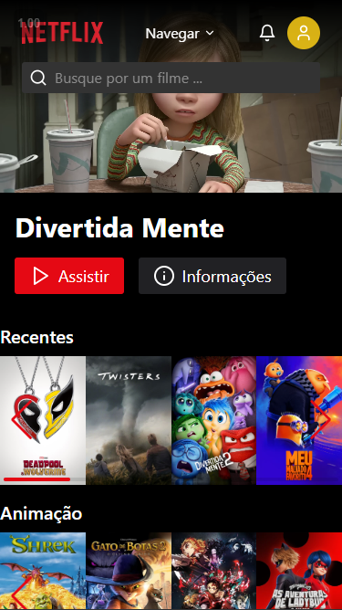
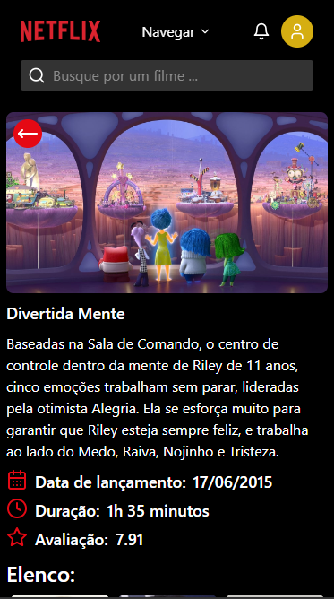

## 🖥 Desktop

## 📱 Mobile

## 📌 Sobre

**Atividade 6 - Criação de um Clone Front-end da Netflix.**

## 🚀 Tecnologias utilizadas

O projeto foi desenvolvido utilizando as seguintes tecnologias:

- [Vite](https://vitejs.dev/)
- [Typescript](https://www.typescriptlang.org/)
- [TMDB](https://www.themoviedb.org/?language=pt-BR)
- [Tailwindcss](https://tailwindcss.com/)
- [React-router](https://reactrouter.com/en/main)
- [Lucide-icons](https://lucide.dev/icons/)
- [Zustand](https://zustand-demo.pmnd.rs/)
- [Swiper](https://swiperjs.com/)
- [Axios](https://axios-http.com/)
-

## ✏ Como rodar localmente

- Clonar o repositório
    <pre><code>git clone https://github.com/CaioMMendes/MaisPraTi</code></pre>

- Acessar a pasta da atividade desejada pelo terminal (caso não esteja na pasta da atividade)
    <pre><code>cd modulo04/atividade06</code></pre>

- Instalar as dependências (precisa ter o node instalado no computador)
    <pre><code>npm i</code></pre>

- Executar o projeto
    <pre><code>npm run dev</code></pre>

- Abrir o navegador na porta informada no terminal

## 💻 O projeto pode ser vizualizado acessando o seguinte link

<https://atividade06-caio.vercel.app/>

## 👀 Exemplo

<https://github.com/user-attachments/assets/5198927a-572a-44ef-b362-18a6451781a3>
